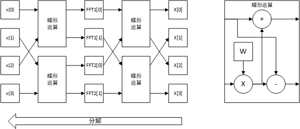

# FFT前置知识

## FT和DFT

傅里叶变换FT（fourier transform）用于将时域信号$x(t)$和频域信号$X(f)$之间变换，公式如下所示：
$$
X(f) = \int^{\infty}_{-\infty}x(t)e^{-j2\pi ft}dt \\
x(t) = \int^{\infty}_{-\infty}X(f)e^{j2\pi ft}df
$$
对于计算机系统中，无法处理连续的过程，因此离散化为离散傅里叶变换DFT（Discrete Fourier Transform）：
$$
X[k] = \frac{1}{N}\sum\limits^{N-1}_{n=0} x[n] \times e^{-\frac{2\pi k}{N}j\times n} \\
x[n] = \frac{1}{N}\sum\limits^{N-1}_{k=0} X[k]\times e^{-\frac{2\pi n}{N}j\times k}
$$
取$W_N  = e^{-\frac{2\pi}{N}j}$，可将DFT改写为以下公式：
$$
X[k] = \frac{1}{N}\sum\limits^{N-1}_{n=0} x[n] \times W_N^{kn} \\
x[n] = \frac{1}{N}\sum\limits^{N-1}_{k=0} X[k]\times W_N^{-kn}
$$

## DFT改进（削减计算量）

首先分析原始公式的计算量，取一个8点DFT算法，对于一个点：

- 需要复数乘法N次，每次复数乘法由四次实数乘法和两次实数加法实现
- 需要复数加法N-1次，每次复数加法由两次实数加法构成

因此，对于一个点，需要实数乘法共4N次，实数加法共（2N-2+2N）=4N-2次。削减计算量的主要重点在$W_N$上，使用欧拉公式有：
$$
W_N^{k} = e^{-\frac{2\pi}{N}jk} = \cos\frac{2\pi k}{N} - j\sin\frac{2\pi k}{N}
$$
考虑$W_N^{k+\frac{N}{2}}$的情况，有以下公式：
$$
W_N^{k+\frac{N}{2}} = e^{-\frac{2\pi}{N}j(k+\frac{N}{2})} = \cos\frac{2\pi (k+\frac{N}{2})}{N} - j\sin\frac{2\pi (k+\frac{N}{2})}{N} \\
= \cos(\frac{2\pi k}{N}+\pi) - j\sin(\frac{2\pi k}{N}+\pi) = -\cos\frac{2\pi k}{N} + j\sin\frac{2\pi k}{N} = -W_N^{k}
$$
同理有$W_N^{k+N} = W_N$，因此以一个4点DFT为例，有以下公式：
$$
X[1] = x(0)W_4^0 + x(1)W_4^1 +x(2)W_4^2+x(3)W_4^3 =[x(0) - x(2)]W^0_4 + [x(1)-x(3)]W_4^2
$$
可减少所需要的复数乘法的次数，进而减少对应的实数乘法和加法的数量

# FFT

## 基2FFT

基2FFT指点数为$2^n$的FFT变换，取$N = 2^n$的FFT变换如下所示：
$$
X[k] = \sum\limits^{N-1}_{n=0}x(n)W_N^{kn} = \sum\limits^{\frac{N}{2}-1}_{n=0}x(2n)W_N^{2kn} + \sum\limits^{\frac{N}{2}-1}_{n=0}x(2n+1)W_N^{(2n+1)k}
$$
将一个N点的FFT分解为两个FFT，一个为奇数项的FFT，另一个为偶数项的FFT。对于$W_N^{nk}$而言，考虑以下变化：
$$
W_N^{2nk} = e^{-\frac{2\pi \times 2nk}{N}j} = e^{-\frac{2\pi \times nk}{\frac{N}{2}}j} = W_{\frac{N}{2}}^{nk}
$$
带入上式，有以下：
$$
X[k] =\sum\limits^{\frac{N}{2}-1}_{n=0}x(2n)W_N^{2kn} + W_N^k\sum\limits^{\frac{N}{2}-1}_{n=0}x(2n+1)W_N^{2nk} = \sum\limits^{\frac{N}{2}-1}_{n=0}x(2n)W_{\frac{N}{2}}^{kn} +W_N^k \sum\limits^{\frac{N}{2}-1}_{n=0}x(2n+1)W_{\frac{N}{2}}^{nk}
$$
取$FFT_1(k) = \sum\limits^{\frac{N}{2}-1}_{n=0}x(2n)W_{\frac{N}{2}}^{kn} $和$FFT_2(k) = \sum\limits^{\frac{N}{2}-1}_{n=0}x(2n+1)W_{\frac{N}{2}}^{nk}$分别是两个长度为$\frac{N}{2}$的FFT运算，有：
$$
X[k] = FFT_1(k) +W_N^k\times FFT_2(k)
$$
上述有$n < \frac{N}{2}$，考虑后半段结果，有：
$$
FFT_1(k+\frac{N}{2}) =\sum\limits^{\frac{N}{2}-1}_{n=0}x(2n)W_{\frac{N}{2}}^{n(k+\frac{N}{2})} = \sum\limits^{\frac{N}{2}-1}_{n=0}x(2n)W_{\frac{N}{2}}^{nk+\frac{Nk}{2}} = \sum\limits^{\frac{N}{2}-1}_{n=0}x(2n)W_{\frac{N}{2}}^{kn} = FFT_1(k)
$$
同理有$FFT_2(k+\frac{N}{2}) = FFT_2(k)$，因此当$n \geq \frac{N}{2}$时，考虑$W_N$的周期性，有：
$$
X[k] = FFT_1(k) + W_N^{k+\frac{N}{2}}\times FFT_2(k) =FFT_1(k) - W_N^k\times FFT_2(k)
$$
综上所述对于一个N点的FFT运算，有
$$
X[k] = \begin{cases} FFT_1(k) +W_N^k\times FFT_2(k) & k < \frac{N}{2} \\
 FFT_1(k-\frac{N}{2}) -W_N^k\times FFT_2(k-\frac{N}{2}) & k \geq \frac{N}{2} \end{cases}
$$
其中，$FFT_1$为对偶数序列的$\frac{N}{2}$点FFT；$FFT_2$为对应奇数序列的$\frac{N}{2}$点FFT。该操作将一个N点FFT分解为两个$\frac{N}{2}$点的FFT。

## 蝶形运算

蝶形运算为一个二输入二输出的运算，公式如下所示：
$$
Y_1 = X_1 + W \times X_2 \\
Y_2 = X_1 - W \times X_2
$$
其中$X_1,X_2$为两个输入；$Y_1,Y_2$为两个输出；W为权值，均为复数。蝶形运算可以用于映射基2FFT，首先考虑2点FFT，两点FFT公式如下所示：
$$
X[0] = x(0)\times W_2^0 + x(1) \times W_2^0 = x(0) + W_2^0 \times x(1) \\
X[1] = x(0)\times W_2^0 + x(1) \times W_2^1 = x(0) - W_2^0 \times x(1)
$$
因此可以使用一个蝶形运算实现，权值为$W_2^k$，现考虑一个4点FFT，首先将其分解为2个两点FFT，分解的公式为
$$
X[k] = \begin{cases} FFT_1(k) +W_N^k\times FFT_2(k) & k < \frac{N}{2} \\
 FFT_1(k-\frac{N}{2}) -W_N^k\times FFT_2(k-\frac{N}{2}) & k \geq \frac{N}{2} \end{cases}
$$
分解步骤也可以用蝶形运算实现，因此整体运算如下图所示：

更多点数的FFT可以类似的进行，即不断分解为长度为一半的奇偶序列的FFT变换分层实现。

