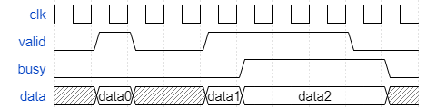
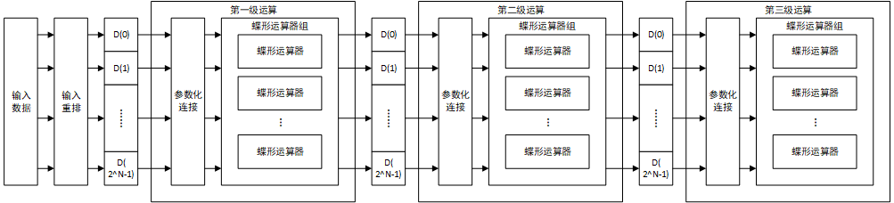

# 目录

[TOC]

# 1.设计目标

设计一个可以计算$2^N$点FFT的FFT加速流水线运算器，要求：

- N从2到10整数连续可配置
- 运算器全并行实现

# 2.参数表

| 名称   | 默认值 | 说明     |
| ------ | ------ | -------- |
| NPOINT | 8      | 点数     |
| WIDTH  | 16     | 数据位宽 |

# 3.IO端口

## 3.1.端口说明

### 3.1.1.系统端口

| 名称  | 类型  | 位宽 | 说明                 |
| ----- | ----- | ---- | -------------------- |
| clk   | input | 1    | 系统时钟             |
| rst_n | input | 1    | 系统复位信号，低有效 |

### 3.1.2.输入端口

| 名称      | 类型   | 位宽                      | 说明                       |
| --------- | ------ | ------------------------- | -------------------------- |
| din_valid | input  | 1                         | 输入有效信号               |
| din_busy  | output | 1                         | 输入忙信号                 |
| din_data  | input  | $2^{NPOINT} \times WIDTH$ | 输入数据，共$2^{NPOINT}$个 |

### 3.1.3.输出端口

| 名称       | 类型   | 位宽                      | 说明           |
| ---------- | ------ | ------------------------- | -------------- |
| dout_valid | output | 1                         | 输出有效信号   |
| dout_busy  | input  | 1                         | 输出忙信号     |
| dout_real  | output | $2^{NPOINT} \times WIDTH$ | 输出数据的实部 |
| dout_imag  | output | $2^{NPOINT} \times WIDTH$ | 输出数据的虚部 |

## 3.2.端口时序

输入输出端口均为标准的P2P接口，P2P端口时序有以下规定：

- 当且仅当`valid`信号为高且`busy`信号为低时数据传输发生且数据有效
- 当`valid`拉高但由于`busy`为高导致传输阻塞时，在传输完成前`valid`不可撤销
- `valid`和`busy`信号之间没有相互依赖关系，即`valid`不需要等待`busy`为低后再拉高

对于以上说明，有下图所示的时序图：

图中，`valid`为低表示无传输请求，此时不关心数据总线`data`上的值。当`valid`为高时，若`busy`为低，则传输发生，从机采样`data`总线的数据，随后可以撤销`valid`或继续发送。若`valid`为高时`busy`为高，则传输阻塞，必须保证`data`上数据有效且`valid`不被拉低直到`busy`为低传输发生。

## 3.3.IO数据

输入输出的数据部分如下所示：

- `din_data`：输入数据为$2^{NPOINT}$个实数，每个WIDTH，顺序排列共$2^{NPOINT} \times WIDTH$，第i个数据位于$i \times WIDTH$bit\~$(i+1) \times WIDTH - 1$bit
- `dout_real`与`dout_imag`：输出为$2^{NPOINT}$个虚数，分为实部和虚部分别存储，其中`dout_read`存储实部，`dout_imag`存储虚部，存储方式与`din_data`类似。第i个输出的实部位于`dout_real`的$i \times WIDTH$bit\~$(i+1) \times WIDTH - 1$bit，虚部位于`dout_imag`的$i \times WIDTH$bit\~$(i+1) \times WIDTH - 1$bit

# 4.系统结构

## 4.1.系统框图

上图为一个三级的8点FFT流水化运算器，主要有以下部分构成：

- 输入重排序：对输入数据进行重新排序，集成在第一级运算器中实现
- 参数化连接：根据当前运算的级数和总点数参数化连接输入和每一个蝶形运算器
- 蝶形运算器组：每个蝶形运算器组共$2^{NPOINT}$个蝶形运算器，产生权值并完成输入数据的蝶形运算

## 4.2.核心算法

