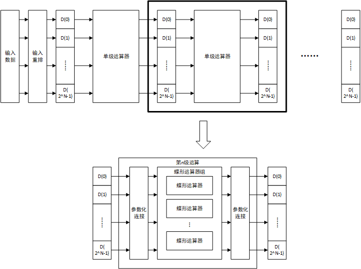

# 目录

[TOC]

# 1.设计目标

设计一个可以计算$2^N$点FFT的FFT加速流水线运算器，要求：

- N从2到10整数连续可配置
- 运算器全并行实现

# 2.参数表

| 名称   | 默认值 | 说明     |
| ------ | ------ | -------- |
| NPOINT | 8      | 点数     |
| WIDTH  | 16     | 数据位宽 |

# 3.IO端口

## 3.1.端口说明

### 3.1.1.系统端口

| 名称  | 类型  | 位宽 | 说明                 |
| ----- | ----- | ---- | -------------------- |
| clk   | input | 1    | 系统时钟             |
| rst_n | input | 1    | 系统复位信号，低有效 |

### 3.1.2.输入端口

| 名称      | 类型   | 位宽                      | 说明                       |
| --------- | ------ | ------------------------- | -------------------------- |
| din_valid | input  | 1                         | 输入有效信号               |
| din_busy  | output | 1                         | 输入忙信号                 |
| din_data  | input  | $2^{NPOINT} \times WIDTH$ | 输入数据，共$2^{NPOINT}$个 |

### 3.1.3.输出端口

| 名称       | 类型   | 位宽                      | 说明           |
| ---------- | ------ | ------------------------- | -------------- |
| dout_valid | output | 1                         | 输出有效信号   |
| dout_busy  | input  | 1                         | 输出忙信号     |
| dout_real  | output | $2^{NPOINT} \times WIDTH$ | 输出数据的实部 |
| dout_imag  | output | $2^{NPOINT} \times WIDTH$ | 输出数据的虚部 |

## 3.2.端口时序

输入输出端口均为标准的P2P接口，P2P端口时序有以下规定：

- 当且仅当`valid`信号为高且`busy`信号为低时数据传输发生且数据有效
- 当`valid`拉高但由于`busy`为高导致传输阻塞时，在传输完成前`valid`不可撤销
- `valid`和`busy`信号之间没有相互依赖关系，即`valid`不需要等待`busy`为低后再拉高

对于以上说明，有下图所示的时序图：

图中，`valid`为低表示无传输请求，此时不关心数据总线`data`上的值。当`valid`为高时，若`busy`为低，则传输发生，从机采样`data`总线的数据，随后可以撤销`valid`或继续发送。若`valid`为高时`busy`为高，则传输阻塞，必须保证`data`上数据有效且`valid`不被拉低直到`busy`为低传输发生。

## 3.3.IO数据

输入输出的数据部分如下所示：

- `din_data`：输入数据为$2^{NPOINT}$个实数，每个WIDTH，顺序排列共$2^{NPOINT} \times WIDTH$，第i个数据位于$i \times WIDTH$bit\~$(i+1) \times WIDTH - 1$bit
- `dout_real`与`dout_imag`：输出为$2^{NPOINT}$个虚数，分为实部和虚部分别存储，其中`dout_read`存储实部，`dout_imag`存储虚部，存储方式与`din_data`类似。第i个输出的实部位于`dout_real`的$i \times WIDTH$bit\~$(i+1) \times WIDTH - 1$bit，虚部位于`dout_imag`的$i \times WIDTH$bit\~$(i+1) \times WIDTH - 1$bit

# 4.系统结构

## 4.1.系统框图

上图为一个三级的8点FFT流水化运算器，主要有以下部分构成：

- 输入重排序：对输入数据进行重新排序，集成在第一级运算器中实现
- 参数化连接：根据当前运算的级数和总点数参数化连接输入和每一个蝶形运算器
- 蝶形运算器组：每个蝶形运算器组共$2^{NPOINT}$个蝶形运算器，产生权值并完成输入数据的蝶形运算

## 4.2.核心算法

### 4.2.1.蝶形运算

蝶形运算的公式如下所示：
$$
Y_1 = X_1 + W_N^k \times X_2 \\
Y_2 = X_1 - W_N^k \times X_2
$$
蝶形有两个虚数输入$X_1$和$X_2$，两个虚数输出$Y_1$和$Y_2$，$W_N^k$为权值，由蝶形运算器生成，其中N为运算级数的2次幂，k为组内偏移，详情见[4.2.3.参数化连接]。一个$2^N$点的FFT可以被分解为N级蝶形运算，具体参见base文档。

### 4.2.2.输入重排序

在分解过程中，需要不断将偶数序列和奇数序列提出，以8点FFT为例，可分解为`{x[0],x[2],x[4],x[6]}`和`{x[1],x[3],x[5],x[7]}`的奇偶序列，对于`{x[0],x[2],x[4],x[6]}`的4点FFT，可以分解为`{x[0],x[4]}`和`{x[2],x[6]}`的奇偶序列。最终，8点FFT输入数据为`{x[0],x[4],x[2],x[6],x[1],x[5],x[3],x[7]}`。为了实现该重排序，有以下算法：
$$
new\_index = reverse(index)
$$
$reverse()$表示二进制值逆序，即例如在8点FFT中，$x[4]$源index为4，二进制为`100`，二进制逆序后为`001`，即新的位置为1（二进制为`001`）。

### 4.2.3.参数化连接

参数化连接为硬线连接（非使用MUX），对于$2^N$点FFT，共需要N级（0~N-1）FFT运算器组，每一组$\frac{N}{2}$个蝶形运算器。第n级蝶形运算而言，需要将蝶形运算器分为$\frac{N}{2} \times {2^{-n}}$组，每个组共$2^n$个运算器。因此对于每个蝶形运算器而言，输入第G组，组内偏移为GB（Group Bias）。对于每组的第i个蝶形运算器，其G和GB为：
$$
G = i // (2^n) \\
GB = i \% (2^n)
$$
对于任意一个蝶形运算器，其两个操作数的位置为：
$$
index_{op1} = G \times 2^n \times 2 + GB \\
index_{op2} = G \times 2^n \times 2 + GB + Bias_{OP}
$$
其中$Bias_{OP}$为操作数偏移量，有$Bias_{OP} = 2^n$，带入上式，有：
$$
index_{op1} = G \times 2^n \times 2 + GB \\
index_{op2} = G \times 2^n \times 2 + (GB + 2^n)
$$
由于蝶形运算为原位运算，即输入和输出的位置相同，因此对于输出位置同样有：
$$
index_{r1} = G \times 2^n \times 2 + GB \\
index_{r2} = G \times 2^n \times 2 + (GB + 2^n)
$$
对于任意一个第n级的组号为G的第GB个运算器，其生成的权值为$W_{2^{n+1}}^{GB}$

